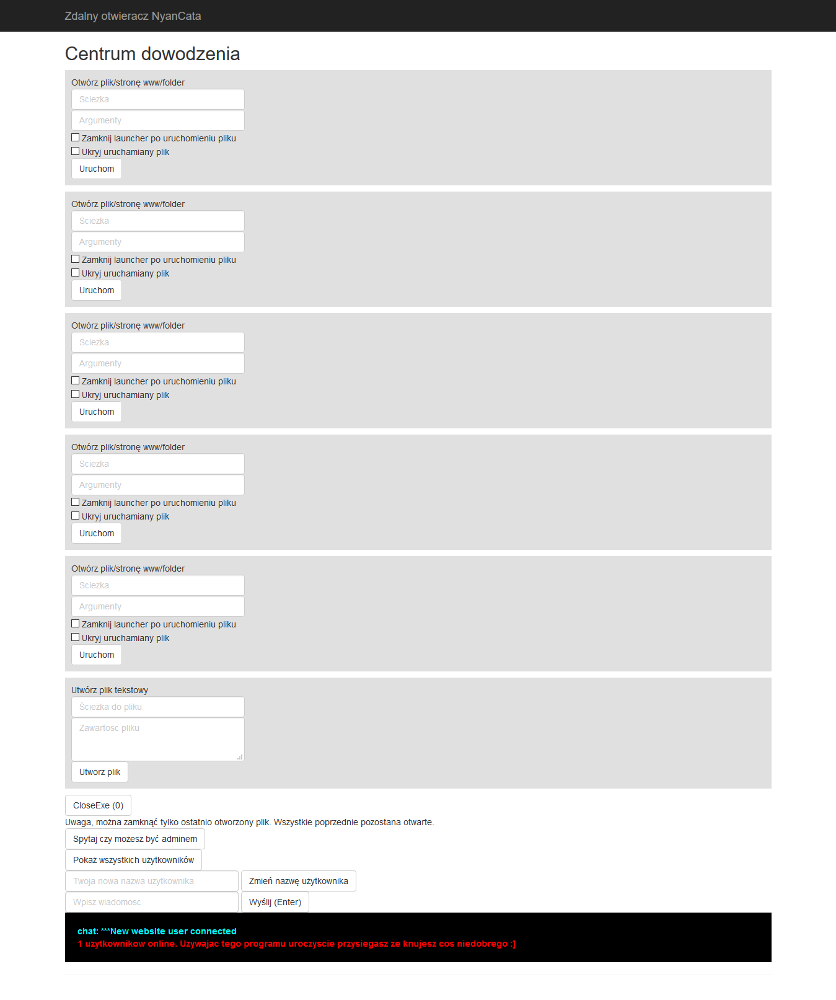
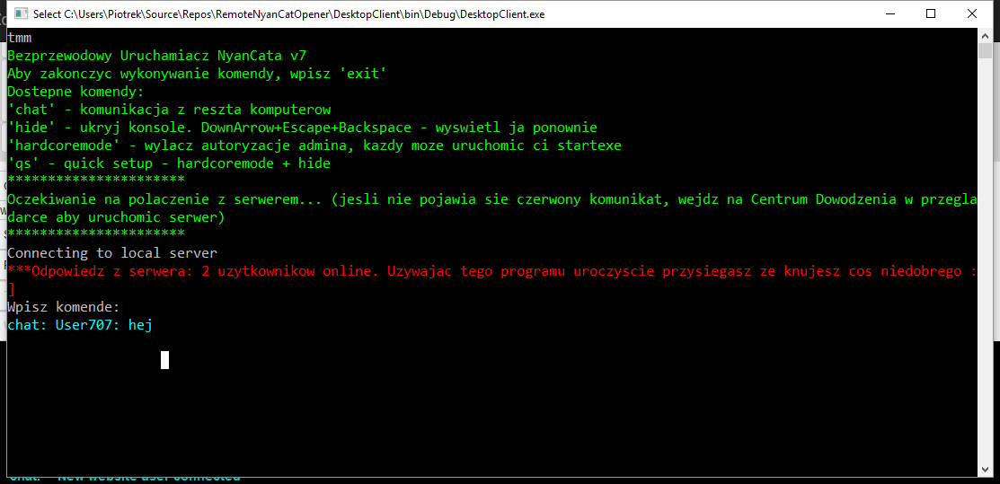

# Bezprzewodowy uruchamiacz NyanCata
Najznamienitszy okaz polskiej myśli technicznej, genialny i jedyny w swoim rodzaju pokaz gimnazjalnego humoru. Program pozwala na zdalne uruchamianie aplikacji na komputerze z poziomu aplikacji webowej.

Wersja C++ działa, chociaż zalecam używanie wersji C#. 

## Aplikacja `DesktopClient`:
Komenda "qs" uruchamia quick setup. "tmm" - więcej opcji.

## Aplikacja `Server`:
Strona startowa nie jest prawdziwa, Centrum Dowodzenia dostępne po adresem `/Home/ControlPanel`. Hasło to `banan`.

## Screenshoty:

Aplikacja webowa:

Aplikacja trojan wgrywana na komputer:

